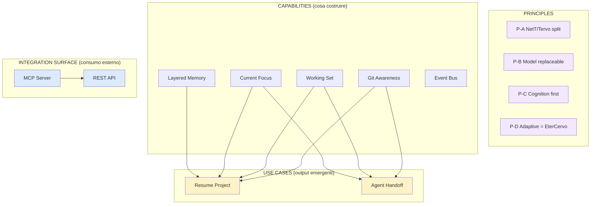
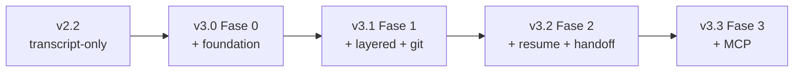

# NeuralTape V3 — Roadmap (Review Lex v0.2)

**Version:** 0.2 (Review-driven restructuring)
**Status:** Draft — In attesa di conferma Guglielmo
**Author:** Lex per Guglielmo
**Date:** 2026-07-14
**Language:** Italian (content), English (code/IDs)
**Extends:** V3 Strategic Evolution Roadmap v0.1 (ChatGPT + Guglielmo)
**Non sostituisce:** il documento di visione v0.1 — lo riorganizza in registro eseguibile.

---

## 0. Perché questa v0.2

La v0.1 è una **visione valida** ma una **roadmap non eseguibile**:
- 7 priorità ★★★★★ su 12 = nessuna priorità reale.
- Mischia Principles, Capabilities, Use Cases e Integration Surface in un'unica lista numerata.
- Mancano fasi, dipendenze, exit criteria, migration path e metriche di successo.

Questa v0.2 **non cambia la visione**. La decostruisce in categorie ordinate per tipo,
poi la ricostruisce in **fasi con dipendenze topologiche**. Obiettivo: avere un
registro di lavoro azionabile, non una wish list.

> **Regola di lettura:** se un item non ha un'uscita verificabile (deliverable o
> exit criterion) non è una priorità, è un principio o un desiderio.

---

## 1. Sintesi della review

| Aspetto | v0.1 | v0.2 |
|---------|------|------|
| Vision (Cognitive Middleware) | ✅ Solida | Mantenuta |
| Separazione NetT / EterCervo | ✅ Chiarissima | Promossa a Principle |
| Roadmap eseguibile | ❌ Wish list | ✅ Fasi con dipendenze |
| Coerenza interna | ⚠️ Dipendenze nascoste | Esplicitate (grafici) |
| Migration v2.2 → v3 | ❌ Assente | ✅ Aggiunta |
| Metriche di successo | ❌ Assenti | ✅ Aggiunte (da definire) |

### Cosa è cambiato strutturalmente

1. **Principles separati da Priorities** (P11 Adaptive Lex, P12 Preserve EterCervo Authority → Principles).
2. **Capabilities vs Use Cases** (P4 Resume Project, P5 Agent Handoff → Use Cases che *consumano* capabilities).
3. **MCP prima di REST** (inversione: P7 sale, P6 scende). Giustificazione in §4.4.
4. **Event Bus smembrato** (minimale in Fase 0, completo in Fase 2 — non bloccante upfront).
5. **Aggiunti i gap engineering**: secret redaction, multi-project, cost model, failure modes, storage, success metrics.

---

## 2. Principles (non prioritarizzabili, non numerabili)

Questi **non sono feature**. Sono vincoli architetturali che ogni fase deve rispettare.

### P-A — Separazione delle responsabilità NeuralTape / EterCervo
- NeuralTape: observe → extract → summarize → prepare context.
- EterCervo: document → organize → preserve → knowledge.
- EterCervo è **source of truth permanente**. NeuralTape è **volatile e orchestrabile**.
- EterCervo **non dipende** mai da NeuralTape.

### P-B — Il modello è sostituibile, la memoria no
- Nessun accoppiamento a un LLM vendor-specific (oggi DeepSeek, domani altro).
- Nessun accoppiamento a un agent vendor-specific (Copilot, Claude Code, Codex, Kimi…).

### P-C — Cognition before visualization
- Niente UI, dashboard, browser finché il motore cognitivo non è maturo.
- Validazione via CLI + file JSON/Markdown, non via frontend.

### P-D — Adaptive agents sono governance EterCervo, non feature NeuralTape
- L'idea "Adaptive Lex" (P11 in v0.1) riguarda il design degli agent di EterCervo
  (vedi `agents.md` Sezione 1).
- **Out of scope** per NeuralTape. NeuralTape fornisce solo il contesto che
  alimenta la modalità dinamica dell'agent; l'agent resta proprietà di EterCervo.

---

## 3. Tassonomia corretta

**Legenda colori:** viola = Principles (vincoli), bianco = Capabilities (lavoro vero),
giallo = Use Cases (emergono, non si costruiscono direttamente), blu = Integration Surface.

---

## 4. Mappatura v0.1 → v0.2

| v0.1 | Tipo reale | Destinazione v0.2 |
|------|-----------|-------------------|
| P1 Layered Memory | Capability | **Fase 1** |
| P2 Current Focus | Capability | **Fase 1** |
| P3 Working Set | Capability | **Fase 1** |
| P4 Resume Project | Use Case | **Fase 2** (emerge da Fase 1) |
| P5 Agent Handoff | Use Case | **Fase 2** (emerge da Fase 1) |
| P6 Public API | Integration | **Fase 3** (dopo MCP) |
| P7 MCP Support | Integration | **Fase 3** (prima di REST) |
| P8 Memory Browser | Nice-to-have | **Backlog indefinito** |
| P9 Git Awareness | Capability | **Fase 1** (foundation) |
| P10 Event Bus | Capability | **Fase 0** (minimale) + **Fase 2** (completo) |
| P11 Adaptive Lex | Out of scope | → Principles (P-D) |
| P12 Preserve EterCervo Authority | Principle | → Principles (P-A) |

### 4.1 Perché P4 e P5 non sono capability

`Resume Project` e `Agent Handoff` sono **composizioni** di Current Focus + Working
Set + Git Awareness + (per l'handoff) un renderer. Trattarli come priorità peer
significa rischiare di costruire l'output prima dell'input. Si costruiscono quando
le capability sottostanti sono stabili.

### 4.2 Perché P10 (Event Bus) è smembrato

Un event bus completo (test, build, docker, deploy, todo completed) è sovrastruttura
se non hai prima i consumatori (layered memory + git awareness). Però un **bus
minimale** (transcript + git commit) serve subito come foundation. Quindi:
- **Fase 0:** bus minimale (2 source types).
- **Fase 2:** bus completo (10+ source types).

### 4.3 Perché P1 non viene prima di P9

Layered Memory senza Git Awareness produce memoria solo conversazionale —
esattamente il limite che v3 vuole superare. Git Awareness entra in Fase 1 insieme
a Layered Memory per evitare di costruire un layer semantico che ignora metà dei
 segnali.

### 4.4 Perché MCP prima di REST

- **MCP è consumer-ready oggi**: Claude Code, Cursor, Codex, OpenCode, Kimi Code lo
  parlano nativamente. Costruire MCP significa che i 5 agent della tua stack possono
  consumare NeuralTape senza glue code.
- **REST serve per integrazioni non-agent** (script custom, dashboard esterne,
  tooling), che sono rare nel tuo flusso.
- Costruire prima REST e poi MCP significa **duplicare la superficie**: ogni
  capability va esposta due volte.
- **Inversione consigliata:** MCP in Fase 3, REST solo se un caso d'uso reale lo
  richiede (possibilmente mai, o come thin wrapper sopra MCP).

---

## 5. Fasi di lavoro (registro eseguibile)

Ogni fase ha: **Goal**, **Deliverables**, **Exit Criteria**, **Dipendenze**, **TODO checklist**.

### FASE 0 — Foundation (prerequisiti)

**Goal:** rendere NeuralTape pronto a ricevere capability v3 senza ridisegnare le fondamenta.

**Deliverables:**
- D0.1 Secret redaction layer (regex + blocklist) prima del classifier.
- D0.2 Multi-project scoping (per-workspace `current-focus`, `working-set`, `memory`).
- D0.3 Storage strategy: SQLite per episodic/semantic, JSON per working/handoff.
- D0.4 Event bus minimale: source types `transcript` + `git.commit`.
- D0.5 Cost/fallback policy: budget DeepSeek, soglia di skip, modalità offline.
- D0.6 Failure modes: classifier error, transcript corrotto, timer saltato → log + retry, mai silent loss.

**Exit Criteria:**
- [ ] Un transcript con un token API viene redatto prima di raggiungere DeepSeek.
- [ ] Due progetti (es. Zeus + cais-lp) hanno stato isolato e non si contaminano.
- [ ] Un episodio scritto 30 giorni fa è ancora leggibile senza ri-classificarlo.
- [ ] DeepSeek down → NeuralTape degraded mode esplicito, non crash.

**Dipendenze:** nessuna (partenza).

**TODO Fase 0:**
- [ ] 0.1 Definire regex redaction (API keys, JWT, AWS, GCP, .env vars, password patterns).
- [ ] 0.2 Scegliere schema SQLite (`episodes`, `decisions`, `patterns`, `focus_history`).
- [ ] 0.3 Definire identità di progetto (path root → project_id stabile).
- [ ] 0.4 Implementare `EventBus` con interface `publish(event)` + 2 adapter.
- [ ] 0.5 Configurare budget alert + soglia di fallback (es. >X chiamate/ora → skip).
- [ ] 0.6 Scrivere tests per failure modes (transcript malformato, network error).

---

### FASE 1 — Cognition Core

**Goal:** NeuralTape capisce cosa sta succedendo (transcript + git) e lo espone in forma strutturata.

**Deliverables (capabilities):**
- D1.1 **Layered Memory** (P1): working → episodic → semantic → identity. MemPalace come **possibile** consolidation engine esterno, **non** duplicato dei layer interni.
- D1.2 **Git Awareness** (P9): capture commit, branch switch, merge, tag, PR (se disponibile).
- D1.3 **Current Focus** (P2): `current-focus.json` per progetto, con **confidence definita** (vedi Open Question Q1).
- D1.4 **Working Set** (P3): `working-set.json` per progetto, generato da recent edits + git diff + heuristic.

**Exit Criteria:**
- [ ] Un agent nuovo (es. Claude Code) apre un progetto e legge `current-focus.json` senza ulteriore contesto.
- [ ] `working-set.json` contiene ≥80% dei file effettivamente modificati nei 30 min precedenti (verificato via git).
- [ ] Un'episodio promosso da working → episodic → semantic sopravvive al riavvio.
- [ ] Git Awareness cattura un commit e ne estrae intent senza testo aggiuntivo nel chat.

**Dipendenze:** Fase 0 completa.

**TODO Fase 1:**
- [ ] 1.1 Definire schema dei 4-5 layer (lifetime, trigger di promozione, query interface).
- [ ] 1.2 Decidere MemPalace: integration esterna vs layer nativo (Open Question Q2).
- [ ] 1.3 Definire `confidence` (euristica? LLM-as-judge? git-confirmed?).
- [ ] 1.4 Implementare git adapter per Event Bus (post-commit hook + poll fallback).
- [ ] 1.5 Implementare `current-focus` generator (LLM + heuristics).
- [ ] 1.6 Implementare `working-set` generator (mtime + git + LLM rank).
- [ ] 1.7 Tests: accuracy current-focus su 10 sessioni storiche.

---

### FASE 2 — Project Continuity (use cases)

**Goal:** composizione delle capability di Fase 1 in continuity reale di progetto e di agent.

**Deliverables (use cases):**
- D2.1 **Resume Project** (P4): output markdown/JSON come da esempio v0.1.
- D2.2 **Agent Handoff** (P5): bundle pronto per agent diverso (focus + working set + recent decisions + active TODO + branch + modified files).
- D2.3 **Event Bus completo** (P10): test, build, docker, deploy, todo completed.

**Exit Criteria:**
- [ ] `resume-project <project>` produce output in <2s e include TODO aperti, decisioni recenti, file attivi, problemi noti.
- [ ] Passaggio Copilot → Claude Code richiede solo lettura dell'handoff bundle, zero spiegazione manuale.
- [ ] Event Bus cattura un `pytest failure` e lo collega all'episodio di codice corretto.

**Dipendenze:** Fase 1 completa.

**TODO Fase 2:**
- [ ] 2.1 Definire formato `resume-project` (template markdown + JSON sidecar).
- [ ] 2.2 Definire formato `handoff-bundle` (un file? directory? MCP resource?).
- [ ] 2.3 Implementare adapter Event Bus per pytest, docker, build system.
- [ ] 2.4 Implementare adapter per TODO completed (parse `todos/*.md` di EterCervo).
- [ ] 2.5 Tests end-to-end: handoff Copilot → Claude Code su progetto reale.

---

### FASE 3 — Integration Surface

**Goal:** ogni agent della stack può consumare NeuralTape senza glue code.

**Deliverables (integration):**
- D3.1 **MCP Server** (P7): espone `current-focus`, `working-set`, `memory`, `resume-project`, `handoff`, `capture` come MCP tools/resources.
- D3.2 **REST API** (P6) — **solo se** emerge un caso d'uso non-agent. Altrimenti skip.

**Exit Criteria:**
- [ ] Claude Code, Cursor, Codex possono leggere `current-focus` via MCP senza configurazione custom.
- [ ] Un `POST capture` via MCP aggiunge un episodio manuale se serve (es. nota vocale trascritta).

**Dipendenze:** Fase 2 completa.

**TODO Fase 3:**
- [ ] 3.1 Scegliere SDK MCP (Python ufficiale).
- [ ] 3.2 Definire tool surface (minima: 5-6 tool, non di più).
- [ ] 3.3 Test di consumo da almeno 2 agent diversi.
- [ ] 3.4 Documentare setup in `NeuralTape/docs/MCP.md`.
- [ ] 3.5 (Condizionale) REST API thin wrapper sopra MCP.

---

### BACKLOG — Non ora

| Item | Perché rinviato |
|------|----------------|
| Memory Browser (P8 v0.1) | Cognition first. UI dopo, se serve. |
| Internal RAG / vector search | Conflict con "no semantic search" di v0.1. Rivisitare solo se retrieval strutturato non basta. |
| Multi-user | Caso d'uso non attuale. |
| Analytics dashboard | Visualization, non cognition. |
| Adaptive Lex (P11 v0.1) | Governance EterCervo, non NeuralTape. |

---

## 6. Migration path v2.2 → v3

**Principio:** nessun big-bang. Rollout incrementale con coesistenza.

### Strategia
- **`_Lex/memory.md` resta formato source of truth** durante tutta la migrazione.
- v3 scrive in parallelo (new tables/files) senza rompere v2.2.
- Feature flag `NEURALTAPE_V3=1` attiva i nuovi componenti incrementalmente.
- A fine Fase 1, v2.2 classifier viene rimosso (Fase 1 lo sostituisce con il layer working→episodic).

### TODO migration:
- [ ] M.1 Versionare lo schema (SQLite migration scripts).
- [ ] M.2 Backfill: importare `_Lex/memory.md` esistente in episodic/semantic tables.
- [ ] M.3 Feature flag + logging di quale path è attivo.
- [ ] M.4 Smoke test di coesistenza (v2.2 + v3 Fase 0 in parallelo per 1 settimana).

---

## 7. Open Questions (decisioni pendenti)

Questi **bloccano** alcune Fasi. Vanno risolti con Guglielmo prima di iniziare.

### Q1 — Come si calcola `confidence` in `current-focus.json`?
**Decisione (2026-07-14):** D — Combinazione pesata con peso maggiore su
git-confirmed. Formula: `0.5·git_coherence + 0.3·working-set_overlap + 0.2·llm_judge`.
Se nessun commit recente (<24h) → abbondanza: `confidence * 0.85`
accompagnato da `confidence_note: "inferred, no recent commit"`.

### Q5 — Trigger di rigenerazione di `current-focus.json`?
**Decisione (2026-07-14):** D — Ibrido: idle-trigger (riusa il polling di v2.2
a costo zero, classificazione dopo 10 min di inattività) + invalidation immediata
su branch switch. Il file viene marcato stale e rigenerato al prossimo idle o
alla prossima richiesta agent. Nessuna rigenerazione eager costosa.

### Q6 — Success metrics: come sappiamo che v3 > v2.2?
**Decisione (2026-07-14):** Metriche primarie M1 + M2.
- **M1 — Tempo a context:** target <30s (vs ~2min di lettura memory.md).
  Misurato: tempo tra `request-context` e risposta pronta per l'agent.
- **M2 — Accuracy handoff:** target ≥90%. Misurato: sample manuale settimanale
  su 10 handoff — quante volte l'agent B prosegue senza errori di contesto evitabili.
Secondarie (monitoraggio): M3 latency pre_load.py (target ≤ v2.2), M4 coverage episodi (target ≥70%).

---

## 8. Registro TODO consolidato (estratto per `todos/`)

Questa è la vista piatta di tutti i TODO delle fasi, pronta per essere spostata in
`EterCervo/todos/neural-tape-v3.md` quando Guglielmo conferma.

### Fase 0 — Foundation
- [x] 0.1 Regex secret redaction
- [x] 0.2 Schema SQLite (episodes, decisions, patterns, focus_history)
- [x] 0.3 Identità di progetto (path → project_id)
- [x] 0.4 EventBus minimale (transcript + git.commit)
- [x] 0.5 Cost/fallback policy DeepSeek
- [x] 0.6 Tests failure modes (47/47, tutti verdi)

### Fase 1 — Cognition Core
- [ ] 1.1 Schema 4-5 layer + trigger di promozione
- [x] 1.2 Decisione MemPalace (Q2) — ✅ Chiusa (opzione C)
- [x] 1.3 Definizione confidence (Q1) — ✅ Chiusa (opzione D, pesata git-heavy)
- [x] 1.4 Git adapter per Event Bus
- [x] 1.5 Generator `current-focus.json` — ✅ In produzione (`lex/v3/focus.py`, per-progetto sotto `tape/v3/projects/`)
- [x] 1.6 Generator `working-set.json` — ✅ In produzione (`lex/v3/workset.py`)
- [ ] 1.7 Tests accuracy su 10 sessioni storiche

### Fase 2 — Project Continuity
- [x] 2.1 Formato `resume-project` — ✅ In produzione (`lex/v3/resume.py`, nel cron path)
- [x] 2.2 Formato `handoff-bundle` — ✅ In produzione (`lex/v3/handoff.py`, nel cron path)
- [ ] 2.3 Adapter Event Bus (pytest, docker, build)
- [ ] 2.4 Adapter TODO completed (EterCervo)
- [ ] 2.5 E2E handoff Copilot → Claude Code

### Fase 3 — Integration Surface
- [ ] 3.1 SDK MCP Python
- [ ] 3.2 Tool surface MCP (5-6 tool)
- [ ] 3.3 Test consumo 2+ agent
- [ ] 3.4 Docs `NeuralTape/docs/MCP.md`
- [ ] 3.5 (Condizionale) REST wrapper

### Migration
- [ ] M.1 Schema versioning
- [ ] M.2 Backfill memory.md → episodic/semantic
- [ ] M.3 Feature flag `NEURALTAPE_V3`
- [ ] M.4 Smoke test coesistenza 1 settimana

### Decisioni pendenti (risolte)

Tutte le 6 Open Questions sono state chiuse con Guglielmo il 2026-07-14:

- [x] **Q1** → **D** (combinazione pesata, git-heavy)
- [x] **Q2** → **C** (ibrido con interface, MemPalace backend futuro)
- [x] **Q3** → **Confermato SQLite** via stdlib `sqlite3`
- [x] **Q4** → **C** (config esplicita `.neuraltape/project.yaml`)
- [x] **Q5** → **D** (idle-trigger + invalidation su branch switch)
- [x] **Q6** → **M1 + M2** (tempo a context target <30s, accuracy handoff target ≥90%)

**Nessun bloccante residuo per Fase 1.**

---

## 9. Note finali

- Questo documento **non è la specifica tecnica**. È la **roadmap riorganizzata**.
  La specifica tecnica di ogni Fase si scrive quando quella Fase entra in lavorazione.
- Il documento di visione v0.1 ** resta valido** come intento strategico. Questa v0.2
  è il ponte fra visione e implementazione.
- Tutte le raccomandazioni Lex sono **modificabili**: se Guglielmo ha un'opinione
  diversa su Q1-Q6 o sull'ordinamento delle Fasi, si discute prima di partire.

---

## 10. Stato avanzamento

1. ✅ **Guglielmo conferma o corregge** v0.2 — Fatto (2026-07-14, tutte le raccomandazioni accolte).
2. ✅ **Guglielmo risolve Q1-Q6** — Tutte e 6 chiuse. Nessun bloccante per Fase 1.
3. ✅ **Lex sposta §8 in `EterCervo/todos/neural-tape-v3.md`** — Fatto.
4. ✅ **Lex scrive specifica tecnica di Fase 0** (`NeuralTape/docs/v3-phase0-spec.md`) — Fatto + implementata e testata (47/47).
5. ✅ **Inizio implementazione Fase 0** — Completata (tutti gli exit criteria verdi).
6. ✅ **Fase 1 (Cognition Core)** — Completata: `current-focus` e `working-set` generator in produzione via `neural-tape-v3.timer` (attiva dal 2026-07-20, v2.2 dismessa).
7. ✅ **Fase 2 (Project Continuity, use cases)** — `resume.py` e `handoff.py` in produzione nel cron path; test suite 91/91 verdi (2026-07-21).
8. **Fase 3 (Integration Surface: MCP server)** — Prossimo passo. In parallelo: hardening residuo (1.7 tests accuracy su sessioni storiche, 2.3-2.5 adapter Event Bus completi, gate formali di `docs/v3-phase1-spec.md` §9).

---

**End of v0.2.**
