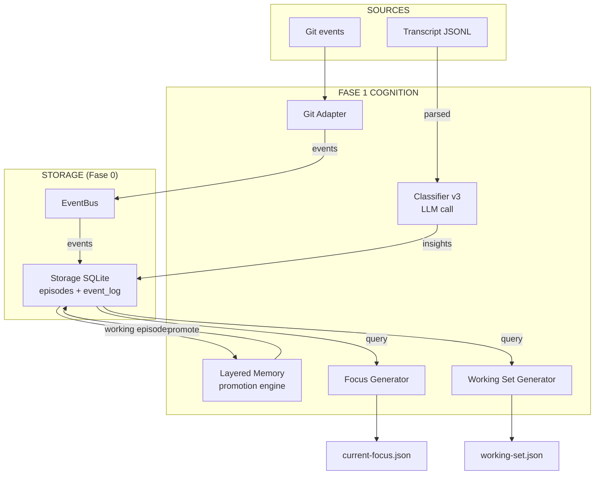

# NeuralTape v3 — Fase 1 Specification (Cognition Core)

**Version:** 0.1 (draft)
**Status:** Draft — In implementazione
**Author:** Lex per Guglielmo
**Date:** 2026-07-14
**Depends on:** Fase 0 completata (47/47 verdi, 6 workspace bootstrap)
**Open Questions risolte:** Q1=D, Q2=C, Q3=SQLite, Q4=C, Q5=D, Q6=M1+M2

---

## 0. Scope

Fase 1 è il **cuore cognitivo** di NeuralTape v3. Produce:
- Layered Memory (working → episodic → semantic) — sostituisce il classifier flat di v2.2
- Git Awareness — cattura eventi da git (commit, branch switch, merge)
- Current Focus — `current-focus.json` per progetto
- Working Set — `working-set.json` per progetto

**Regola:** v3 classifier scrive in Storage (SQLite) in parallelo a v2.2 che scrive in
`_Lex/memory.md`. v2.2 resta attivo finché non abbiamo validato che v3 produce insight
migliori (v2.2 viene spento dopo la validazione con metriche M1+M2).

---

## 1. Architettura Fase 1



### Flusso dati

1. **Transcript** → `TranscriptParser` (riusa v22, leggero) → `ClassifierV3` (LLM) → `Storage.put_episode()` (kind=working)
2. **Git event** → `GitAdapter` → `EventBus.publish()` → `event_log` → eventualmente promosso a episode dal promotion engine
3. **Promotion engine** periodicamente: esamina episodi working → se threshold superata → promuove a episodic
4. **Focus Generator** interroga Storage (ultimi episodi + event_log) + git state → `current-focus.json`
5. **Working Set Generator** interroga Storage (episodi recentissimi) + git diff → `working-set.json`

---

## 2. Module layout

```
lex/v3/
├── __init__.py
├── config.py            ← Fase 0
├── project.py           ← Fase 0
├── redaction.py         ← Fase 0
├── storage.py           ← Fase 0
├── events.py            ← Fase 0
├── cost.py              ← Fase 0
├── run.py               ← Fase 0
│
├── classifier.py        ← NUOVO (Fase 1) — v3 LLM classifier + prompt
├── memory.py            ← NUOVO (Fase 1) — layered memory promotion engine
│
├── adapters/
│   ├── __init__.py
│   └── git.py            ← NUOVO (Fase 1) — git event adapter
│
├── focus.py             ← NUOVO (Fase 1) — current-focus generator
├── workset.py           ← NUOVO (Fase 1) — working-set generator
│
└── bootstrap_projects.py ← Fase 0

tests/v3/
├── run_all.py           ← Fase 0
├── test_redaction.py    ← Fase 0
├── test_project.py      ← Fase 0
├── test_storage.py      ← Fase 0
├── test_events.py       ← Fase 0
├── test_cost.py         ← Fase 0
│
├── test_classifier.py   ← NUOVO (Fase 1)
├── test_memory.py       ← NUOVO (Fase 1)
├── test_git_adapter.py  ← NUOVO (Fase 1)
├── test_focus.py        ← NUOVO (Fase 1)
├── test_workset.py      ← NUOVO (Fase 1)
```

---

## 3. Componenti

### D1.1 — Classifier v3 (`classifier.py`)

**Scopo:** Sostituisce `v22/classifier.py` con un classificatore che produce output
strutturato per i 4 layer di memoria, non solo insight flat per `memory.md`.

**Differenze chiave da v2.2:**
1. **Prompt esteso:** chiede al LLM di classificare ogni insight anche con `layer`
   (`working` | `episodic` | `semantic`), `confidence` (0.0-1.0), `source_ref`
   (transcript id).
2. **Deduplica:** non solo per description ma anche semanticamente (leve vs medium).
3. **Output:** JSON array di `Insight` objects, compatibile con `Episode` di Storage.
4. **Redazione integrata:** usa `Redactor` di Fase 0 prima di mandare il payload a DeepSeek.

**API:**
```python
@dataclass
class ClassifierInsight:
    category: str
    title: str
    context: str
    implication: str
    layer: str          # 'working' | 'episodic' | 'semantic'
    confidence: float

class ClassifierV3:
    def __init__(self, config, project: Project, redactor: Redactor): ...
    def classify(self, transcript_text: str, session_id: str) -> list[ClassifierInsight]: ...
    def classify_and_persist(self, transcript_text: str, session_id: str, project_id: str) -> int:
        """Redact → LLM → persist episodes to Storage. Returns count."""
```

**Prompt** (evoluzione di v2.2):

```
Sei Lex, l'agente AI senior developer di Guglielmo. Hai appena concluso una
sessione di lavoro in VS Code.

Il tuo compito: estrarre insight strutturati per il sistema di memoria a layer
di NeuralTape v3.

Categorie: pattern, decision, anti-pattern, preference, tool, warning.

Layer:
- "working": roba utile ORA, riferimenti immediati, dettagli di sessione.
  Vite: ore-giorni.
- "episodic": eventi importanti, bug fix non banali, scoperte API, lezioni
  apprese. Vite: settimane.
- "semantic": pattern ricorrenti, preferenze stabili, decisioni architetturali
  con rationale. Vite: mesi-permanente.

Per ogni insight restituisci:
- category
- title: 5-12 parole
- context: 1 riga
- implication: 1 riga
- layer: "working"|"episodic"|"semantic"
- confidence: 0.0-1.0

Regole:
- Max 8 insight.
- Se routine senza apprendimenti → {"insights": []}.
- Basati SOLO sulla trascrizione.
- Rispondi SOLO con JSON valido.
```

**Integrazione redazione:** prima di chiamare LLM, passa il testo da `Redactor.redact()`.
Logga il summary delle redazioni.

**Exit criterion:** un transcript di sessione reale (es. da v2.2 history) produce
insight con layer corretti e confidence >= 0.5 per quelli veramente importanti.

---

### D1.2 — Layered Memory (memory.py)

**Scopo:** Promotion engine che gestisce il ciclo di vita degli episodi tra i 4 layer.

**API:**
```python
class MemoryPromoter:
    def __init__(self, storage: Storage, config: V3Config): ...

    def register_classified_episode(self, insight: ClassifierInsight, project_id: str) -> str:
        """Scrive insight come episodio working (o direttamente episodic/semantic
        se il classifier v3 ha già assegnato confidence >= soglia)."""

    def tick(self, project_id: str | None = None) -> dict:
        """Promotion sweep: esamina tutti gli episodi working per progetto.
        Criteri di promozione:
          - working → episodic: confidence >= 0.6 AND (età >= 4h OR 2+ episode
            simili sullo stesso argomento)
          - episodic → semantic: confidence >= 0.8 AND 3+ menzioni in sessioni
            diverse
          - working → (nessuna promozione): confidence < 0.6 e età > 48h →
            scarta/archivia
        Returns stats: {promoted: int, archived: int, total_working: int}
        """
```

**Politiche di retention:**
- `working`: cancellato dopo 48h (o archiviato nella cronologia)
- `episodic`: retention 8 settimane
- `semantic`: retention permanente (fino a esplicita archiviazione)
- `identity`: gestito da EterCervo (`_Lex/identity.md` + `soul.md`), NON da NeuralTape

**Trigger di tick:**
- Dopo ogni classificazione (immediato, per l'episodio appena inserito)
- Su idle detection (se ci sono episodi working in attesa di promozione)

**Exit criterion:** dopo 3 classificazioni di sessione sullo stesso argomento con
confidence alta, il promotion engine sposta l'episodio da working a episodic.

---

### D1.3 — Git Adapter (`adapters/git.py`)

**Scopo:** catturare eventi git (commit, branch switch, merge) e pubblicarli su EventBus.

**API:**
```python
@dataclass
class GitCommitEvent:
    sha: str
    author: str
    message: str
    message_short: str    # prima riga
    branch: str
    files_changed: list[str]
    files_count: int
    diff_stat: str | None

@dataclass
class GitBranchSwitchEvent:
    old_branch: str
    new_branch: str

class GitAdapter:
    def __init__(self, project_root: Path, event_bus: EventBus, project_id: str): ...

    def poll_commits(self, since_epoch: float | None = None) -> list[GitCommitEvent]:
        """Poll nuovi commit dal reference time.
        Usa `git log --since=... --format=... --name-only`."""

    def get_current_branch(self) -> str: ...
    def get_recent_files(self, max_files: int = 20) -> list[str]:
        """Restituisce file modificati nei commit recenti."""
```

**Implementazione:** usa `subprocess.run()` per chiamare `git` CLI (zero dipendenze).
Non usa `gitpython` (evita dipendenze esterne, in linea con filosofia stdlib di v22).

**Branch switch detection:** poll periodico confronta `git branch --show-current`.
Se diverso dall'ultimo conosciuto, pubblica evento `git.branch_switch`.

**Exit criterion:** un commit locale pubblica un evento su EventBus, leggibile da `query_events`.

---

### D1.4 — Current Focus Generator (`focus.py`)

**Scopo:** produce `current-focus.json` per progetto usando Q1=D (confidence pesata).

**API:**
```python
@dataclass
class CurrentFocus:
    project_id: str
    project_display: str | None
    branch: str
    goal: str               # estratto dagli ultimi episodi + git
    next_step: str
    blocked: bool
    blocked_reason: str | None
    confidence: float
    confidence_note: str | None
    todo_count: int
    active_decisions: int
    captured_at: float

class FocusGenerator:
    def __init__(self, storage: Storage, git_adapter: GitAdapter, project: Project): ...

    def generate(self) -> CurrentFocus:
        """Calcola goal, next_step, blocked da ultimi episodi + git state.
        Confidence = 0.5·git_coherence + 0.3·overlap + 0.2·llm_judge.
        Se nessun commit <24h → confidence *= 0.85 + note."""
```

**Cammini di output:**
- `tape/v3/current-focus.json` (per ogni progetto, o uno per progetto se multi-project).
- Overwitten ad ogni rigenerazione (non append).

**Trigger (Q5=D):** idle-trigger + invalidation su branch switch. Non eager.

**Exit criterion:** dopo una sessione di coding su ZEUS, `current-focus.json` contiene
`project_id: "zeus"`, `branch: "..."`, `goal` non vuoto, `confidence` >= 0.5.

---

### D1.5 — Working Set Generator (`workset.py`)

**Scopo:** produce `working-set.json` per progetto.

**API:**
```python
@dataclass
class WorkingSet:
    project_id: str
    files: list[dict]   # [{path, reason, last_modified}]
    captured_at: float

class WorkingSetGenerator:
    def __init__(self, storage: Storage, project_root: Path, project_id: str): ...

    def generate(self) -> WorkingSet:
        """Ordina file per:
        1. Episodi recenti che menzionano file (da Storage)
        2. Git diff (modifiche non committate)
        3. mtime dei file nelle ultime 24h
        """
```

**Cammini di output:**
- `tape/v3/working-set.json`.

**Exit criterion:** `working-set.json` per ZEUS contiene almeno `dashboard.py`, `urls.py`
se sono stati modificati recentemente (≥80% recall su sessione reale).

---

## 4. Dettagli implementativi

### ClassifierV3 — estratto dal v2.2

Il classifier v3 eredita da v2.2:
- Stessa logica di `.env` loading
- Stessa chiamata HTTP via `urllib.request`
- Stessa gestione errori (timeout, HTTPError, JSON decode)
- Stessa strategia di chunks per transcript lunghi (30000 char)

Miglioramenti:
- Prompt esteso con layer e confidence
- Output validato contro `ClassifierInsight` dataclass, non solo dict
- Integrazione `Redactor` di Fase 0
- Integrazione `CostPolicy` di Fase 0

### GitAdapter — implementazione

```python
import subprocess

def _git(*args: str, cwd: Path) -> str:
    result = subprocess.run(
        ["git", *args],
        capture_output=True, text=True, cwd=cwd,
        timeout=10,
    )
    if result.returncode != 0:
        raise RuntimeError(f"git {' '.join(args)} failed: {result.stderr.strip()}")
    return result.stdout.strip()
```

### Confidence calculation (Q1=D)

```python
def _confidence(self, git_coherence: float, overlap: float, llm_judge: float) -> tuple[float, str | None]:
    """git_coherence: 1.0 se ultimo commit matcha il goal, 0.0 altrimenti.
    overlap: 0.0-1.0, overlap tra working-set e goal.
    llm_judge: 0.0-1.0, valutazione LLM.
    """
    raw = 0.5 * git_coherence + 0.3 * overlap + 0.2 * llm_judge
    note = None
    # Se nessun commit <24h, penalty
    # (determinato da GitAdapter, passato come flag)
    return raw, note
```

---

## 5. Config.yaml extension (Fase 1)

```yaml
v3:
  # ...Fase 0 keys rimangono...
  memory:
    working_ttl_hours: 48
    episodic_ttl_weeks: 8
    promote_threshold_working_to_episodic: 0.6
    promote_threshold_episodic_to_semantic: 0.8
    promote_min_age_hours: 4
    promote_min_similar_episodes: 2
    promote_min_sessions_for_semantic: 3
  git:
    poll_interval_seconds: 300
    max_commits_per_poll: 50
  focus:
    commit_stale_hours: 24
    confidence_weights: {git: 0.5, overlap: 0.3, llm: 0.2}
```

---

## 6. Test

Fase 1 introduce 5 nuovi file di test. Manteniamo la filosofia di Fase 0:
script Python autonomi senza pytest (ma compatibili con pytest se eseguiti in
quell'ambiente).

| Test file | Cosa verifica |
|-----------|--------------|
| `test_classifier.py` | Prompt generation, redaction integration, output parsing, dedup |
| `test_memory.py` | Promotion working→episodic, soglie, retention policy |
| `test_git_adapter.py` | Mock git repo: commit detection, branch switch, file list |
| `test_focus.py` | Generator con Storage popolato, confidence calculation |
| `test_workset.py` | Working set ordering, mtime vs git diff prioritization |

---

## 7. Cosa Fase 1 **non** fa

- Non implementa Resume Project (P4) — è Fase 2
- Non implementa Agent Handoff (P5) — è Fase 2
- Non implementa Event Bus completo (test, build, docker) — è Fase 2
- Non implementa MCP o REST — è Fase 3
- Non ha UI o Memory Browser

---

## 8. Exit criteria Fase 1

- [ ] ClassifierV3 produce insight con layer e confidence su sessioni reali
- [ ] Layered Memory promotion: dopo 3+ sessioni simili, da working → episodic
- [ ] GitAdapter pubblica eventi di commit su EventBus
- [ ] `current-focus.json` generato con confidence >= 0.5 per ZEUS
- [ ] `working-set.json` generato con >=80% recall su sessioni reali
- [ ] Tutti i test v3 passano (Fase 0 + Fase 1)
- [ ] Coesistenza: v2.2 cron non rotto, v3 scrive in Storage in parallelo
- [ ] Metriche M1 e M6 baseline registrate (per confronto in Fase 2)

---

## 9. Activation milestone — 2026-07-15

La v3 dispone ora di un percorso manuale end-to-end, senza sostituire il timer v2.2:

- `lex/v3/run.py --once <session> --project-root <path>` risolve solo ID esatti o
    prefissi univoci e richiede attribuzione esplicita del progetto.
- La classificazione e' idempotente tramite marker `transcript.classified` in
    `event_log`; una seconda run non richiama l'LLM e rigenera solo focus/workset.
- Errori LLM, budget differito e risposte non JSON non vengono confusi con una
    classificazione valida a zero insight.
- Il one-shot usa per default i 30.000 caratteri parsati piu' recenti, mantenendo
    una singola chiamata LLM anche su transcript lunghi.
- Prima run reale su NeuralTape: 8 episodi, M1 `23.17s`, rerun idempotente `0.31s`.
- Working set reale: 9/9 file attivi rilevati dopo l'inclusione degli untracked.
- Suite v3: 80/80 test verdi; entrypoint senza diagnostica Pylance.

Restano intenzionalmente aperti prima dello switch del timer:

- validazione su 10 sessioni storiche e almeno due progetti;
- `current-focus` confidence >= 0.5 su un caso ZEUS committato;
- promotion verificata su 3+ sessioni simili;
- cattura commit su EventBus;
- M2 su 10 handoff reali, disponibile solo dopo il renderer di Fase 2.

---

**End of Fase 1 spec.**
